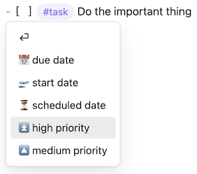

# 智能自动建议

## 介绍

> [!released]
> 在Tasks 1.9.0中引入。

[[Priority|优先级]]、[[Dates|日期]]、[[Recurring Tasks|重复任务]]、[[Task Dependencies|任务依赖]]和[[On Completion|完成时]]页面显示了Tasks插件在搜索任务时识别的各种表情符号和特殊短语。

如果您更喜欢输入任务，而不是使用对话框，现在有一个智能自动建议完成机制，可以为您完成大量表情符号和日期的输入。

在手机上创建和编辑任务时特别强大。

> [!released]
>
> - `➕ created today`在Tasks 3.2.0中引入。
> - `🆔 id`和`⛔ depends on id`在Tasks 7.4.0中引入。

其他任务插件的开发者可以为其用户提供此自动建议功能：请参阅[[Tasks Api#Auto-Suggest Integration|自动建议集成]]。

### 视频演示

通过观看[实际操作视频](https://user-images.githubusercontent.com/10722656/175102574-78b0f851-cc48-4255-a40e-d3036bec5bb6.gif)可能最容易理解。

### 详细演示

这是创建新任务的更详细演示，如果您愿意，可以完全使用键盘完成。

1. 当您输入任务时，自动建议菜单会弹出显示一些常见选项：

    

    **注意**：自动建议菜单仅在光标位于被识别为任务的行中时才会弹出，即该行包含：

     - 带有复选框的项目符号，即以这三个字符之一开头：
         - `- [ ]`
         - `* [ ]`
         - `+ [ ]`
     - 以及全局过滤器（如果有），
     - 并且状态符号（`[`和`]`之间的字符）没有[[Status Types|状态类型]]`NON_TASK`。

     Tasks还尝试根据上下文显示自动建议菜单。例如，当使用[[Dataview Format#Bracketed inline fields|Dataview任务格式]]时，建议只会在方括号`[]`或圆括号`()`内出现。

2. 您可以继续输入（忽略建议），或通过多种方式选择菜单项之一：

    - 鼠标点击菜单项
    - 使用上/下键盘键，然后输入`Return`或`Enter`
    - 输入更多字符，使菜单项更具体。例如，输入`pri`显示设置任务优先级的所有选项。

    **注意**：当菜单顶部显示`⏎`项时，它作为默认选项提供以输入新行而不是选择建议。仅在使用[[Tasks Emoji Format|Tasks表情符号格式]]时没有具体匹配时才显示。

3. 这里我们选择了"高优先级"项，现在菜单更新以显示您可能想要添加的下一个最可能的项。我们将从此菜单中选择"重复（重复）"：

    

4. 现在添加了重复表情符号，菜单提供了一些常见的重复选项：

    

5. 我们选择了`every week`，它被添加到我们的任务中，现在菜单显示剩余的可能表情符号：

    

6. 我们选择了"截止日期"，现在菜单提供了基于当前日期计算的常用日期选择：

    

7. 现在我们的任务完成了：

    

## 详细信息

自动建议菜单在源码模式和实时预览中都有效。

它仅在Tasks插件识别为任务的行上触发：

- 如果您使用[[Global Filter|全局任务过滤器]]，例如`#task`，您需要在菜单弹出之前提供`- [ ] #task`。
- 如果您不使用全局任务过滤器，您只需要在菜单弹出之前提供`- [ ]`。
- 它还识别以星号（`*`）和加号（`+`）字符开头的列表。
- 当使用[[Dataview Format#Bracketed inline fields|Dataview任务格式]]时，建议只会在光标位于方括号`[]`或圆括号`()`内时出现。

菜单是智能的：它只会提供有效选项：

- 例如，如果您已经添加了截止日期，该选项将从菜单中删除。
- 当菜单顶部显示`⏎`项时，它作为默认选项提供以输入新行而不是选择建议。仅在没有具体匹配时才显示。
- 有比菜单中显示的更多识别选项，包括更多日期，如`2 months`、`15 days`。

自Tasks 7.4.0起，菜单支持轻松创建[[Task Dependencies|任务依赖]]。

- 输入`id`过滤显示依赖选项。
- `⛔ depends on id`搜索所有未完成任务的描述。
  - 从菜单中选择一个任务以添加依赖关系，并在需要时自动为所选任务添加`id`值。
  - 添加依赖关系后，如`⛔ dcf64c`，您可以输入逗号（`,`）添加另一个依赖关系 - 您可以根据需要多次执行此操作。
- `🆔 id`允许您为任务添加`id`。
  - 您可以接受其提供的`generate unique id`。
  - 或者如果您愿意，可以输入自己更有意义的`id`，如`🆔 suggester-update-docs`。
  - 确保坚持允许的[[Task Dependencies#`id`|允许的`id`字符]]，不要创建重复的`id`值。

> [!Warning]
>
> - Kanban插件使用此自动建议机制，便于编辑任务。
> - 但是，**这些依赖字段在Kanban中被排除在建议之外**，因为其编辑器不是基于markdown的，不能让Tasks保存新的`id`值。

自动建议菜单支持强大的键盘控制：

- 示例：输入单词`start`的某个部分，您将得到将其转换为开始表情符号的建议。按`<enter>`然后立即添加开始表情符号：🛫。
- 您可以使用[["创建或编辑任务"提供的日期缩写|Create or edit Task#Date abbreviations]]，后跟空格字符。
- 过滤匹配任何地方。例如，如果您尚未为任务添加任何日期，输入`du`将提供`📅 due date`和`⏳ scheduled date`。
- 您可以使用键盘上的上/下箭头键，然后按`<enter>`从菜单中选择。
- 菜单由[[#自动建议的最小匹配长度]]设置控制。其值越高，菜单弹出前您需要输入的内容越多。

需要注意的事项，以确保您的Tasks搜索按预期工作：

- 您可以在表情符号之间混合标签（自Tasks 1.9.0起），但您不得在标签和标识表情符号之间混合描述文本。
  - 请参阅下面的[[#关于任务中项目顺序我需要了解什么？]]。

## 自动建议的限制

有一些自动建议行为可能在未来版本中得到改进：

- 以下尚不支持：
  - 它尚不支持完成和取消日期。
    - 完成日期可以通过"Tasks: 切换任务完成"命令或在实时预览或阅读视图中点击任务的复选框来添加。
    - 完成和取消日期都可以在[[Create or edit Task|创建或编辑任务]]模态框中编辑。
    - 我们在[issue #2863](https://github.com/obsidian-tasks-group/obsidian-tasks/issues/2863)中跟踪此问题。
  - 它尚不提供`when done`。
    - 此短语仍需要手动输入。
    - 我们在[issue #2066](https://github.com/obsidian-tasks-group/obsidian-tasks/issues/2066)中跟踪此问题。
- 它目前在编辑已完成任务时弹出。这可能在将来会改变。
- [["创建或编辑任务"提供的日期缩写|Create or edit Task#Date abbreviations]]仅在输入空格后才有效。
- 当在[[Kanban plugin|Kanban插件]]卡片（或任何其他使用[[Tasks Api#Auto-Suggest Integration|自动建议集成]]的插件）中使用自动建议时，[[Task Dependencies|依赖关系]]建议不可用，因为还没有插件访问库中所有任务的机制。
  - 我们在[issue #3274](https://github.com/obsidian-tasks-group/obsidian-tasks/issues/3274)中跟踪此问题。

## 常见问题

### 关于任务中项目顺序我需要了解什么？

文本、标签和标识表情符号的顺序很重要。

具体来说，Tasks从行尾向后读取，搜索：

- 标识表情符号（截止、计划、重复、优先级）
- 标签

作为自动建议启动的一部分，Tasks现在允许标签混合在表情符号中间和行尾。

一旦找到任何无法识别的文本，它就会停止读取，并忽略该无法识别文本左侧的任何表情符号。

> [!warning]
> 在表情符号及其值之间混合任何描述性文本**将导致描述性文本之前的表情符号不被Tasks识别，并且不可搜索**。

我们在[issue #1505](https://github.com/obsidian-tasks-group/obsidian-tasks/issues/1505)中跟踪此排序限制。

> [!important]
> 请参阅下面的[[#如何找到所有可能格式不正确的任务？]]和[[#如何检查特定任务是否格式正确？]]，了解在开始使用此强大功能时如何检查您的任务。

### 如何找到所有可能格式不正确的任务？

请参阅[[Find tasks with invalid data#Finding unread emojis|查找未读表情符号]]来查找和修复任何具有未读表情符号值的任务。

### 如何检查特定任务是否格式正确？

Tasks插件搜索任务的能力取决于任务中的信息是否与插件的解析行为匹配，如前一节所述。如果不匹配，任务可能会从任务搜索中被静默省略。

考虑这两个任务（在没有全局标签过滤器的库中）：

```text
- [ ] Do stuff at the #office by 📅 2022-07-18 #project-x 🔁 every week #testing
- [ ] Do stuff at the #office by 📅 2022-07-18 for #project-x 🔁 every week #testing
```

乍一看，它们都看起来正确。

但是，问题的第一个迹象出现在阅读视图中：


在第一个任务中，重复和截止日期出现在行尾，按照"创建或编辑任务"模态框写出的顺序。

但是，在第二个任务中，只有重复在行尾。这是因为截止日期没有被识别，由于截止日期表情符号后混合了无法识别的单词**for**，导致该属性不被任务识别。

如果您担心任务在搜索中被遗漏，或者您只是想检查它，您可以点击其行并打开[["创建或编辑任务"模态框|Create or edit Task]]，检查描述字段中是否有不需要的表情符号。

我们的第二个任务看起来像这样。注意截止日期显示在描述框中，并且"没有截止日期"：


### 如何看到更少或更多建议？

在Tasks设置中，将[[#显示的最大自动建议数量]]滑块更改为您想要的值（并重新启动Obsidian）。
