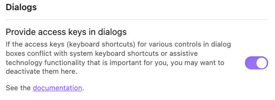

# "创建或编辑任务"模态框

## 介绍

 `Tasks: 创建或编辑`命令帮助您添加或编辑任务。

## 打开"创建或编辑任务"模态框

使用命令"Tasks: 创建或编辑任务"来启动模态框。

- 如果光标在现有任务上，模态框将修改该任务的属性。
- 如果光标在空白行上，模态框将在该行创建一个全新的任务。

## 键盘快捷键

> [!released]
> 在Tasks 1.17.0中引入。

表单的所有字段都有"访问键"，即键盘快捷键。访问键显示为标签中的下划线字母。

- 在Windows上，同时按`Alt`键和下划线字母。
- 在Mac上，同时按`Ctrl`键、`Option`键和下划线字母。

有关键盘快捷键和用于打开此模态框的热键的重要信息，请参阅下面的[[#热键和键盘快捷键冲突]]。

### 关闭键盘快捷键

> [!released]
> 在Tasks 1.17.0中引入。

如果任何字段的访问键（键盘快捷键）与系统键盘快捷键冲突或干扰对您重要的辅助技术功能，您可能希望在Tasks插件的设置中关闭它们：

此设置立即生效，不需要重启Obsidian。

## 输入值

### 描述

这是描述您任务的文本。

如果您启用了[[Global Filter|全局过滤器]]，对话框会自动添加它。

描述框可以通过拖动其角落来放大。可以粘贴多行文本，或拖放到其中，Tasks会自动删除行尾字符。

> [!released]
> 描述字段在Tasks 2.0.0中变为可调整大小。

### 优先级

请参阅[[Priority|优先级]]。

### 重复

在这里您可以使任务重复，这样当它被标记为完成时，会创建一个新任务，具有更新的日期。

> [!Tip]
> 具有重复规则的任务还需要至少有一个截止、计划或开始日期。 
> 请参阅[[Recurring Tasks#Recurring tasks must have at least one date|重复任务必须至少有一个日期]]。

请参阅[[Recurring Tasks|重复任务（重复）]]。

### 日期

在这里您可以选择性地为任务提供
[[Dates#Due date|截止]]、
[[Dates#Scheduled date|计划]]和
[[Dates#Start date|开始]]日期。

您还可以添加或编辑
[[Dates#Created date|创建]]、
[[Dates#Done date|完成]]和
[[Dates#Cancelled date|取消]]日期。

这里有很大的灵活性。例如：

- 您可以输入确切的日期，如`2022-11-28`。
- 您也可以输入日期的部分，如`6 oct`。
- 您可以输入相对日期，如`today`、`tomorrow`、`Saturday`、`10 days`、`2 weeks`。

请注意，相对日期将始终被解释为未来的日期，因为这通常是您想要的。如果您想输入过期任务或试验过去相对日期在查询中的解释方式，可以通过取消选中"仅未来日期"来更改此行为。

> [!Info]
> 如果您在Tasks设置中启用了"为每个添加的任务设置创建日期"（并重启了Obsidian），当您通过此模态框创建新任务时，今天的日期将自动添加。

> [!released]
>
> - `仅未来日期`在Tasks 1.15.0中引入。
> - 编辑[[Dates#Created date|创建]]、[[Dates#Done date|完成]]和[[Dates#Cancelled date|取消]]日期在Tasks 5.5.0中引入。

#### 日期选择器

> [!released]
> 在Tasks 7.13.0中引入。

模态框提供日期选择器，便于为您的任务选择日期。

它在每个平台上使用原生日期选择器，因此确切的外观和行为会有所不同。

日期选择器演示视频

下面的截图来自Mac。

日期选择器允许轻松使用鼠标和键盘添加和编辑日期

#### 日期缩写

> [!released]
> 在Tasks 1.8.0中引入。

模态框还有一些自己的缩写，以加快在日期字段中输入常见值的速度。

输入缩写然后输入空格字符，整个单词将为您输入。

支持的缩写：

| 缩写 | 展开文本 |
| ------------ | ------------- |
| `td`         | `today`       |
| `tm`         | `tomorrow`    |
| `yd`         | `yesterday`   |
| `tw`         | `this week`   |
| `nw`         | `next week`   |
| `weekend`    | `sat`         |
| `we`         | `sat`         |

### 依赖关系

> [!released]
> 在Tasks 6.1.0中引入。

> [!Tip]
> 本节描述了在任务之间添加和编辑依赖关系的机制。
>
> 有关依赖关系功能本身的解释，请参阅[[Task Dependencies|任务依赖]]。

使用模态框的"依赖关系"区域来指定任务之间的关系，以定义您想要处理一组任务的顺序。

> [!Example]
> 这是任务"举办聚会"的依赖关系可能的样子：
>
> 
> 一个需要先完成两个任务"邀请客人"和"制作食物"的任务，完成后将允许开始另一个任务"聚会后清理"。

#### 在此之前

使用"在此之前"区域查找并链接到**必须在正在编辑的任务开始之前完成**的任何任务。

这在上图中标记为**1**和**2**。

#### 在此之后

使用"在此之后"区域查找并链接到**只能在正在编辑的任务完成后开始**的任何任务。

这是上图中的区域**3**和**4**。

#### 搜索任务

理解搜索查询：

- 在"在此之前"或"在此之后"中，开始输入所需任务描述中的任何文本。
- 目前只搜索任务描述，不搜索文件路径。
- 您可以以任何顺序输入单词的片段，大小写无关紧要。
- 例如，您可以用`inv gu`或`gu inv`快速找到`Invite the guests`。

理解匹配：

- 当您输入时，Tasks将显示最多20个最接近的匹配任务。
- 与正在编辑的任务在同一文件中的其他任务首先列出。
- 然后显示库中其他地方的匹配任务，后跟它们的路径。
- 如果任何文本太长而无法适应，它会用`...`截断，您可以将鼠标悬停在名称上以查看完整文本。

这是上述过程的样子：

搜索任务以设置依赖关系

#### 保存依赖关系

当您在编辑依赖关系后点击应用时：

- `id`字段被添加到现在被依赖的任何任务中，
- `dependsOn`字段被调整以添加或删除依赖关系。

这是Tasks中目前唯一可以在一步中编辑库中多个文件的操作。

### 状态

> [!released]
> 在Tasks 1.23.0中引入。

使用状态下拉菜单更改任务的状态符号。

有关更多信息，包括添加您自己的自定义状态，请参阅[[Statuses|状态]]。

#### 状态更改时自动设置日期

> [!released]
> 在Tasks 6.1.0中引入。

当您更改任务的状态符号时，[[Dates#Date-tracking settings|日期跟踪设置]]用于确定是否更新任何日期字段：

- **如果**状态**从**任何其他状态类型**更改为**[[Status Types#DONE|DONE状态类型]]，
  - **并且**启用了"为每个完成的任务设置完成日期"选项，
  - **那么****完成日期**更改为今天的日期。
- **如果**状态**从**任何其他状态类型**更改为**[[Status Types#CANCELLED|CANCELLED状态类型]]，
  - **并且**启用了"为每个完成的任务设置取消日期"选项，
  - **那么****取消日期**更改为今天的日期。

#### 状态更改时覆盖日期

当Tasks自动将创建、完成或取消日期设置为今天时，您可以自由编辑该值。

例如，也许您实际上昨天完成了一个任务但忘记将其标记为完成。现在您可以在模态框中完成它，并在点击应用之前将完成日期设置为昨天。

#### 重写历史：在模态框中完成重复任务

> [!Tip]
> 在编辑任务模态框中将`when done`重复任务标记为完成时，*下一次*出现的日期现在从完成日期字段中的值计算。

完成日期值默认为当前日期，但可以在点击应用之前进行编辑。

如果您意识到忘记在实际完成重复任务的那天将其标记为完成，并且希望基于您真正完成任务的那天而不是今天标记为完成的时候创建新实例，这可能很有用。

（不过，新重复的创建日期仍然使用今天的日期。）

## 显示值

这些值目前无法在此模态框中编辑。

### 已完成

一个只读复选框，显示任务是否已完成。

## 完成

要关闭模态框并保存您的编辑，请执行以下操作之一：

- 点击`应用`，
- 按`Return`或`Enter`。

要关闭模态框并取消您的编辑，请执行以下操作之一：

- 点击`取消`，
- 点击或轻触模态框外部，
- 点击模态框角落的关闭按钮（如果您的操作系统上存在），
- 按`Esc`键。

## 已知限制

### 描述中不支持自动完成

"创建或编辑任务"模态框中的描述字段尚不支持Obsidian的自动完成功能来帮助添加标签、格式化、链接到其他笔记等。

我们在[issue #1763](https://github.com/obsidian-tasks-group/obsidian-tasks/issues/1763)中跟踪此问题。

### 需要在手机屏幕上滚动

在手机屏幕上，"创建或编辑任务"模态框可能太高而无法适应屏幕。
它确实支持滚动，在Android上，滚动条是可见的。

不幸的是，iPhone在您实际开始滚动之前不会显示滚动条。
在屏幕上轻触并向下拖动，您将看到滚动条暂时出现。
更重要的是，滚动然后工作正常。

我们在[issue #1238](https://github.com/obsidian-tasks-group/obsidian-tasks/issues/1238)中跟踪iPhone滚动条问题。

### 热键和键盘快捷键冲突

如果"创建或编辑任务"模态框的[自定义热键](https://help.obsidian.md/Customization/Custom+hotkeys)与此模态框中使用的键盘快捷键[[#键盘快捷键]]之一相同，那么当模态框打开时，**键盘快捷键也会意外触发**。

例如，设置`Alt + O`（Linux和Windows）或`Ctrl + Opt + O`（Mac）将意味着当模态框打开时，选择`最低`优先级，而不是`普通`。

我们在[issue #2503](https://github.com/obsidian-tasks-group/obsidian-tasks/issues/2503)中跟踪此问题。

## 在脚本和其他插件中使用此模态框

[[Tasks Api|Tasks API接口]]允许在Tasks插件之外使用此模态框，例如在QuickAdd脚本中，以及其他插件。
