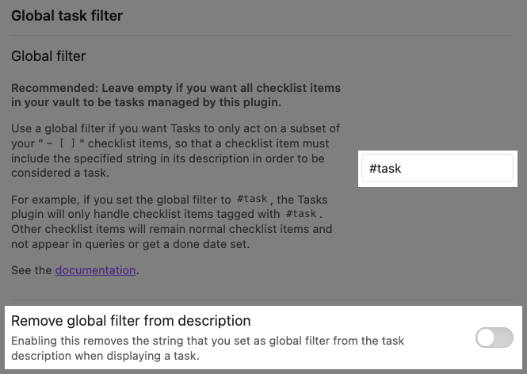

# 全局过滤器

> [!tip]
> 从Tasks 3.5.0开始，添加了新的[[Global Query|全局查询]]功能，它比全局过滤器提供了更多的灵活性。

## 可选的全局过滤器

您可以在设置中设置全局过滤器，使Tasks只匹配特定的清单项目。
例如，您可以将其设置为`#task`，只有当清单项目包含字符串`#task`时才将其作为任务跟踪。
它不必是标签。它可以是任何字符串。
将其留空以将所有清单项目视为任务。

使用全局过滤器`#task`的示例：

```markdown
- [ ] #task 倒垃圾
```

如果您没有设置全局过滤器，所有常规清单项目都将被视为任务：

```markdown
- [ ] 倒垃圾
```

> [!warning]
> 如果您使用诸如`#task`之类的标签作为全局过滤器，则无法向该标签添加子标签。

## 全局过滤器的设置

Tasks选项面板中的以下设置控制库的全局过滤器。

请注意，在此处更改任何设置后，您必须重启Tasks。


<span class="caption">全局过滤器设置选项的图像，显示默认设置</span>


<span class="caption">显示当存在全局过滤器时显示的附加"从描述中删除全局过滤器"设置的图像</span>
