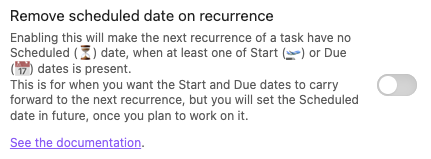
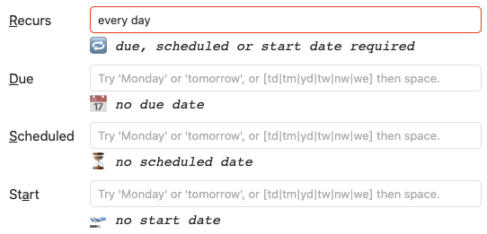

# 重复任务（重复）

## 用法

任务可以是重复的。
为了指定任务的重复规则，您必须附加"重复标识符🔁"，后跟重复规则。
例如：`🔁 every weekday`表示任务将在每周的周一到周五重复。
每个重复规则都必须以单词`every`开头。

当您将重复任务的状态切换为除"待办"之外的任何状态（即"已完成"）时，您想要切换的原始任务将被标记为已完成，并像任何其他任务一样附加完成日期。

此外，默认情况下_新任务将被放置在原始任务上方一行_。

有关如何更改此行为并使新任务出现在_原始任务下方一行_，请参阅下面的[[#Order of the new task|新任务的顺序]]。

新任务将基于原始任务更新日期。

> [!tip]
> 如果您只想要最新的出现，并且不关心看到所有早期任务的混乱，请查看Tasks 7.8.0中添加的新[[On Completion|完成时]]功能。

### 基本示例

以下面的任务为例：

```markdown
- [ ] 倒垃圾 🔁 every Sunday 📅 2021-04-25
```

如果您将上述任务标记为"已完成"，文件现在将如下所示：

```markdown
- [ ] 倒垃圾 🔁 every Sunday 📅 2021-05-02
- [x] 倒垃圾 🔁 every Sunday 📅 2021-04-25 ✅ 2021-04-24
```

2021年4月25日之后的下一个星期日是5月2日。

或者，如果您已启用添加[[Dates#Created date|创建日期]]，文件将改为如下所示，显示创建新任务的日期：

```markdown
- [ ] 倒垃圾 🔁 every Sunday ➕ 2023-03-10 📅 2021-05-02
- [x] 倒垃圾 🔁 every Sunday 📅 2021-04-25 ✅ 2023-03-10
```

## 重复设置

### 新任务的顺序

使用此设置控制重复任务的插入位置。默认是将新任务放在原始任务之前。


> [!released]
> 新任务位置（或顺序）的控制在Tasks 3.8.0中引入

### 重复时删除计划日期

使用此设置控制是否应从下一次出现中删除计划日期。只有当任务还具有开始或截止日期时，才会删除计划日期。

当您希望开始和截止日期延续到下一次重复，但您将在将来设置计划日期（一旦您知道何时打算处理它）时，这很有用。



> [!released]
> 重复时删除计划日期的选项在Tasks 7.19.0中引入。

## 带有自定义状态的重复任务

> [!Warning]
> 如果您使用[[Custom Statuses|自定义状态]]，请参阅[[Recurring Tasks and Custom Statuses|重复任务和自定义状态]]了解这两个功能如何交互的重要信息。

## 基于原始截止日期或完成日期重复任务

当您创建重复任务时，您可以决定下一次出现应该基于原始日期还是您完成任务的日期。
默认行为导致新创建的任务具有相对于原始任务而不是"今天"的日期。

例如，假设今天是2022年2月13日，您刚刚完成了下面的任务：

```markdown
- [ ] 扫地 🔁 every week ⏳ 2021-02-13
- [x] 扫地 🔁 every week ⏳ 2021-02-06 ✅ 2022-02-13
```

无论您是否错过了原始计划日期一周，
新创建的任务仍然安排在原始计划日期后一周：您完成原始任务的同一天。

如果您希望任务相对于"完成"日期而不是原始日期安排，
那么您需要在重复规则的末尾添加`when done`。
下面是与上面相同的示例，但这次新任务是基于您完成任务时的当前日期安排的：

```markdown
- [ ] 扫地 🔁 every week when done ⏳ 2022-02-20
- [x] 扫地 🔁 every week when done ⏳ 2021-02-06 ✅ 2022-02-13
```

现在新创建的任务安排在任务完成后1周，而不是原始安排后1周。

## 如何计算新日期：每月重复

由于日历月份的长度不同，月度重复规则存在一些陷阱。

下面是一些代表性示例来演示行为差异，以帮助您选择使用哪种方法。

请注意，在下面的[[#Examples|示例]]部分中还有几个基于月份的选项。

### every month on the last：可靠且安全

假设我们希望一系列任务在每月的最后一天到期。

实现该目标的最安全方法是使用`every month on the last`。这明确指定了使用月份的哪一天，因此Tasks（或者更确切地说，[rrule](https://github.com/jakubroztocil/rrule)库）按预期计算新的截止日期。

考虑这个任务：

```markdown
- [ ] 做事情 🔁 every month on the last 📅 2022-01-31
```

完成几次后，我们会看到每个新任务都在下个月的最后一天到期：

```markdown
- [ ] 做事情 🔁 every month on the last 📅 2022-06-30
- [x] 做事情 🔁 every month on the last 📅 2022-05-31 ✅ 2022-05-31
- [x] 做事情 🔁 every month on the last 📅 2022-04-30 ✅ 2022-04-30
- [x] 做事情 🔁 every month on the last 📅 2022-03-31 ✅ 2022-03-31
- [x] 做事情 🔁 every month on the last 📅 2022-02-28 ✅ 2022-02-28
- [x] 做事情 🔁 every month on the last 📅 2022-01-31 ✅ 2022-01-31
```

### every month：如果下一个计算日期不存在，将新截止日期提前

假设我们从这个任务开始：

```markdown
- [ ] 做事情 🔁 every month 📅 2021-10-31
```

在这里，重复规则`every month`对日期没有意见，因此Tasks查看正在完成的任务的截止日期来计算下一个截止日期。

完成几次后，我们会看到这样：

```markdown
- [ ] 做事情 🔁 every month 📅 2022-03-28
- [x] 做事情 🔁 every month 📅 2022-02-28 ✅ 2022-02-28
- [x] 做事情 🔁 every month 📅 2022-01-30 ✅ 2022-01-30
- [x] 做事情 🔁 every month 📅 2021-12-30 ✅ 2021-12-30
- [x] 做事情 🔁 every month 📅 2021-11-30 ✅ 2021-11-30
- [x] 做事情 🔁 every month 📅 2021-10-31 ✅ 2021-10-31
```

请注意，由于`2021-11-31`不存在，截止日期被提前到`2021-11-30`。
从那时起，截止日期将基于月份的第30天，除非手动更改。
一旦到达二月，从那时起，截止日期将基于月份的第28天。

这种移动到较早日期而不是跳到下个月对于诸如`every month when done`之类的重复模式特别重要，否则在31天的月末完成月度任务时有时会跳过出现。

### every month on the 31st：跳过少于31天的月份

**注意**：这可能不是您要寻找的选项。如果使用它，请确保您了解它如何跳过少于31天的月份。

假设我们从这个任务开始：

```markdown
- [ ] 做事情 🔁 every month on the 31st 📅 2022-01-31
```

在这里，用户明确要求任务在月份的第31天发生。

在这种情况下，如果新的截止日期落在少于31天的月份，[rrule](https://github.com/jakubroztocil/rrule)会跳到下个月，直到找到有效日期。

因此，当多次完成上述任务时，我们会看到这样，它跳过了二月、四月和六月：

```markdown
- [ ] 做事情 🔁 every month on the 31st 📅 2022-08-31
- [x] 做事情 🔁 every month on the 31st 📅 2022-07-31 ✅ 2022-07-31
- [x] 做事情 🔁 every month on the 31st 📅 2022-05-31 ✅ 2022-05-31
- [x] 做事情 🔁 every month on the 31st 📅 2022-03-31 ✅ 2022-03-31
- [x] 做事情 🔁 every month on the 31st 📅 2022-01-31 ✅ 2022-01-31
```

这是有意的。除了匹配用户请求外，它还匹配[rrule](https://github.com/jakubroztocil/rrule)库实现的[iCalendar RFC](https://tools.ietf.org/html/rfc5545)的[规范](https://datatracker.ietf.org/doc/html/rfc5545#section-3.3.10)：

> 重复规则可能生成具有无效日期（例如，2月30日）或不存在的本地时间（例如，在本地时间在上午1:00向前移动一小时的一天的上午1:30）的重复实例。此类重复实例必须被忽略，并且不得计为重复集的一部分。

## 日期的优先级

任务可以有[[Dates|各种日期]]。
当任务有多个日期时，根据以下优先级选择其中一个作为参考日期：

1. 截止日期
2. 计划日期
3. 开始日期

如果原始重复任务上有多个日期，则下一个重复任务将具有与原始任务相同的日期。
所有下一个重复任务的日期都将具有相对于参考日期的相对距离，就像在原始任务上一样。

例如：一个任务有一个截止日期和一个计划日期。
计划日期设置为截止日期前2天。
任务设置为每两周重复一次。

```markdown
-   [ ] 割草 🔁 every 2 weeks ⏳ 2021-10-28 📅 2021-10-30
```

新任务将具有截止日期提前两周和计划日期，就像在原始任务上一样。

```markdown
-   [ ] 割草 🔁 every 2 weeks ⏳ 2021-11-11 �� 2021-11-13
```

## 示例

可能的重复规则示例（根据需要混合匹配；这些应该被视为灵感）：

- `🔁 every 3 days`
- `🔁 every 10 days when done`
- `🔁 every weekday`（表示每周一至周五）
- `🔁 every week on Sunday`
- `🔁 every week on Tuesday, Friday`（表示每周二和周五）
- `🔁 every 2 weeks`
- `🔁 every 3 weeks on Friday`
- `🔁 every 2 months`
- `🔁 every month on the 1st`
- `🔁 every month on the last`
- `🔁 every month on the last Friday`
- `🔁 every month on the 2nd last Friday`
- `🔁 every 6 months on the 2nd Wednesday`
- `🔁 every January on the 15th`
- `🔁 every February on the last`
- `🔁 every April and December on the 1st and 24th`（表示每个月的1日和24日）
- `🔁 every year`

## 重复任务的限制

### 重复任务必须至少有一个日期

> [!important]
> 为了在基于日期的搜索中使用，重复任务必须至少有一个截止日期、计划日期或开始日期。所谓的参考日期和重复规则必须出现在任务描述之后。

自Tasks 5.0.0以来，此功能已在[[Create or edit Task]]模态中强制执行：



_Above: The 'Create or edit Task', with an error message saying a date must be set on a recurring task._

> [!info] Detail
> 技术上，您_可以_向任务添加重复规则而无需任何日期，并且没有人阻止任何人编辑任务以向其添加重复规则但无日期。
>
> 然而，不清楚这种行为是否有用，并且基于Tasks支持请求，已经看到一些用户误解预期搜索结果。
>
> 这里是一个没有日期的重复任务，已经完成两次：
>
> ```text
> - [x] Do stuff 🔁 every day ✅ 2023-02-11
> - [x] Do stuff 🔁 every day ✅ 2023-02-13
> - [ ] Do stuff 🔁 every day
> ```
>
> 这些任务不能通过通常的截止日期、计划、开始或发生日期搜索搜索：我们认为大多数Tasks用户通过搜索日期找到他们的任务。

### 每日笔记中的任务不应重复

> [!Important]
> 不要在每日笔记中使用`recurring`，因为它会在_每个_每日笔记中创建重复的任务。

这不仅仅是Tasks的限制，更是一种偶尔被用户询问的模式。

当将重复任务输入每日笔记时，模板将为此任务创建任务。在这种情况下，这些任务不应设置为重复。

重复任务可以通过以下方式有效管理：

- **要么**通过模板包含在每日笔记中并设置为非重复（因为每个每日笔记将具有其自己的任务副本）
- **或者**放在除每日笔记之外的文件中并设置为重复。

### Next recurrence has any dependency fields removed

Some users have reported what appears at first glance to be a bug, that when a recurring task is completed, the next instance has any [[Task Dependencies#`id`|id]] and [[Task Dependencies#`dependsOn`|dependsOn]] fields removed.

This is intentional, but has confused some users, so we explain the reason here.

#### Recurrence removing `id`

When initially testing the [[Task Dependencies]] facility, we found that tasks that were 'blocked by' a recurring task were blocked forever, due to creating a new task with a duplicate `id` that is not `DONE`.

We quickly realised that in order for the dependencies mechanism to work, and not create duplicate `id` values, we needed to remove both `id` and `dependsOn`.

#### Recurrence removing `dependsOn`

One way to explain the removal of `dependsOn` in next recurrence is this scenario:

> [!Example]
> Suppose that every Monday you have to go and buy bread. One day you need to go to the bank to get cash first, so you add a dependency, which will naturally apply to just that one week's task.

### Next recurrence is on non-existent date

> [!important]
> There are edge cases for tasks that recur monthly or yearly.
For example, a task may be due `2022-01-31` and recur `every 3 months`.
The next recurrence date of `2022-04-31` does not exist.

In that case, Tasks moves the next occurrence **backwards** to the next valid date.
In this case, that would be `2022-04-30`.

From then on, the due date will be based on the 30th day of the month, unless changed manually.
So the next occurrence would happen on `2022-07-30`, even though July has 31 days.

> [!important]
> With edge cases for tasks that recur monthly or yearly, **if the rule states the actual date of the next recurrence, Tasks will honour that instruction, skipping recurrence dates that do not exist**.

For example, a task may be due `2022-01-31` and recur `every month on the 31st`.
The next recurrence date of `2022-02-31` does not exist.

In that case, Tasks moves the next occurrence **forwards** to the next valid date,
skipping over recurrences with invalid dates.
In this case, that would be `2022-03-31`.

### In Reading mode, no feedback if rule is invalid

In the editor there is no direct feedback to whether your recurrence rule is valid.
You can validate that tasks understands your rule by using the `Tasks: Create or edit` command when creating or editing a task.

### No way to recur for x times

You can _not_ use rules where recurrence happens a certain number of times (`for x times`). Tasks doesn't link the tasks and does not know how often it occurred.

### No way to recur until a specific date

You can _not_ use rules where recurrence ends on a specific date (`until "date"`). There is a bug in [`rrule`](https://github.com/jakubroztocil/rrule) where `until "date"` rules are not converted to the correct text. As a consequence, every subsequent task's "until" date will be one day earlier than the one before. We are tracking this in [issue #1818](https://github.com/obsidian-tasks-group/obsidian-tasks/issues/1818).

### Recurrence rule lost if highest priority date is invalid

> [!important]
> If the highest priority date in a task does not exist (for example, due date is February 30th), when the task is completed the recurrence rule will disappear, and no new task will be created.

For example, consider the following task:

```text
- [ ] Do stuff 🔁 every year 🛫 2024-02-27 ⏳ 2024-02-28 📅 2024-02-30
```

Its highest priority date is the Due date - see [[Recurring Tasks#Priority of Dates|Priority of Dates]] -  which is invalid:  `2024-02-30`.

When this task is completed, the result will be:

```text
- [x] #task Do stuff 🛫 2024-02-27 ⏳ 2024-02-28 📅 Invalid date ✅ 2023-10-21
```

Note that:

- The recurrence rule has disappeared.
- No new task has been created.

This is detectable prior to completing the task by viewing the task in Reading Mode:

- the recurrence rule will be hidden,
- and the date will be displayed as 'Invalid date'.

## Technical Details

Tasks uses the [rrule](https://github.com/jakubroztocil/rrule) library to calculate the next date when completing a recurring task.
