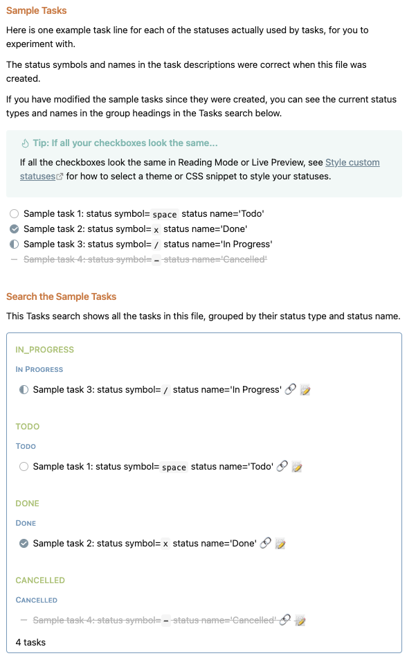

# 检查您的状态

#feature/statuses

> [!released]
> 在Tasks 5.1.0中引入。

## 概述

您可以随时使用Tasks [[Status Settings|状态设置]]中的**"Review and check your Statuses"按钮**来**验证**和**可视化**您的自定义状态。

## 输出文件

- Markdown报告写入库的根目录。
- 示例文件名：
  - `Tasks Plugin - Review and check your Statuses 2023-11-08 21-30-15`
- 通过在文件名末尾添加日期和时间，您可以创建一系列报告，并查看差异。
- 您当然可以随时删除这些文件。

## 报告内容

各部分包括：

- **关于此文件**
  - 介绍。
- **状态设置**
  - 您设置中状态的表格。
  - 在这里您可以找到有关状态设置中任何潜在问题的建议。
- **已加载设置**
  - 这有一个显示状态之间转换的**Mermaid图表**。
  - 在实时预览或阅读模式下查看报告，以查看图表。
- **示例任务**
  - 这有每个有效状态的示例任务行。
  - 在实时预览或阅读模式下查看报告，以检查它们是否与您的主题或CSS片段一起工作。
- **搜索示例任务**
  - 这有一个Tasks搜索，显示此文件中的所有任务，按其状态类型和状态名称分组。

## 示例状态报告

### 表格和图表部分

这是一个示例报告，从[[Recurring Tasks and Custom Statuses#When DONE is not followed by TODO or IN_PROGRESS|当DONE后面不跟TODO或IN_PROGRESS]]中显示的问题状态生成：

 
*示例状态报告*

### 示例任务部分

从Tasks X.Y.Z开始，还将有**示例任务**和**搜索示例任务**部分。

它们的外观取决于您选择的主题或CSS片段。

这是它在**Minimal主题**和在**Minimal主题设置插件**中启用**彩色标题**时的可能样子：

 
*示例状态报告样本*
