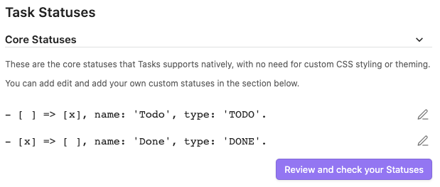

# 核心状态

<span class="related-pages">#feature/statuses</span>

## 概述

核心状态代表传统的markdown任务：

```text
- [ ] 我是一个尚未完成的任务
- [x] 我是一个已经完成的任务
```

它们不需要任何自定义CSS样式或主题就能在Tasks块或实时预览中正确显示。

## 设置中的核心状态

这是核心状态最初在Tasks设置中的样子：



注意`Todo`后面跟着`Done`，这是为了保持与早期Tasks版本的兼容性。

> [!info]
您可以编辑'Todo'核心状态，使其下一个状态符号为`/`，并启用`Todo` -> `In Progress` -> `Done`，如果您喜欢的话。

> [!Tip]
> 随时使用"Review and check your Statuses"按钮来[[Check your Statuses|检查您的状态]]并可视化它们。

## 编辑核心状态

编辑核心状态的唯一限制是您不能更改它们的状态符号。

您可以自由地重命名它们，更改它们的下一个字符，甚至更改它们的状态类型，如果您愿意的话。

## 详细信息

这是您可以如何使用它们：

<!-- placeholder to force blank line before included text --><!-- include: DocsSamplesForStatuses.test.DefaultStatuses_core-statuses.approved.md -->

| 状态符号 | 下一个状态符号 | 状态名称<br>`status.name includes...`<br>`sort by status.name`<br>`group by status.name` | 状态类型<br>`status.type is...`<br>`sort by status.type`<br>`group by status.type` | 需要自定义样式 |
| ----- | ----- | ----- | ----- | ----- |
| `space` | `x` | Todo | `TODO` | No |
| `x` | `space` | Done | `DONE` | No |

<!-- placeholder to force blank line after included text --><!-- endInclude -->
