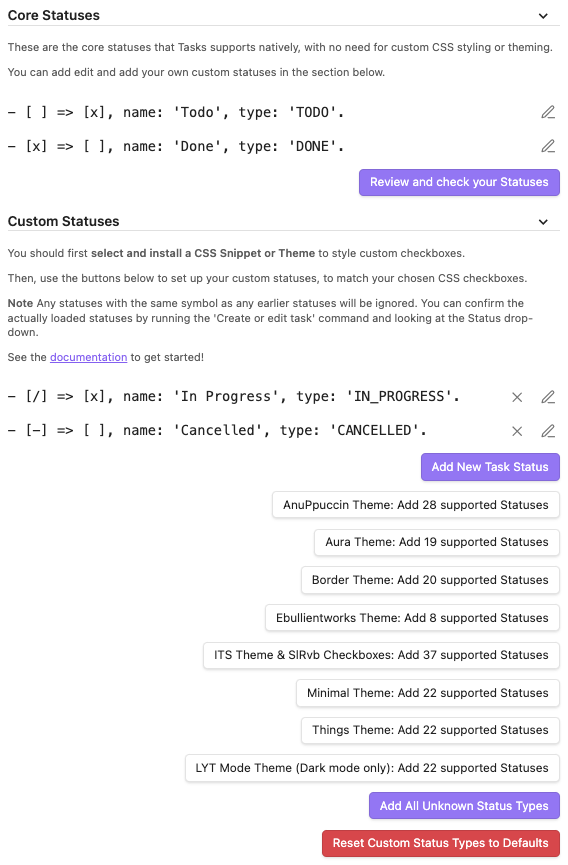
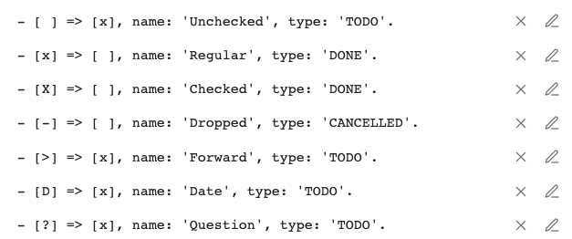

# 状态设置

#feature/statuses

## 概述

这是您首次查看Tasks设置中的任务状态部分时看到的内容：

 
*初始任务状态设置*

有两个部分：

1. **核心状态**
    - 这些是Tasks内置的状态，无法删除。
    - 它们是Obsidian和Tasks原生内置的两种任务类型：`[ ]`和`[x]`。
    - 它们的状态符号无法更改。
    - 它们的所有其他属性都可以编辑。
2. **自定义状态**
    - 这些状态是许多主题称为"自定义复选框"的东西。
    - 您需要选择并安装支持"自定义复选框"的主题或CSS片段
    - Tasks自动添加`[/]`和`[-]`
    - 这里是您可以添加自己的自定义状态的地方。

我们还看到每个状态包括：

- **状态符号**（例如，`x`和`-`）
- **状态名称**（例如，'In Progress'）
- **下一个状态符号**（例如，`x`和`space`）
- **状态类型**（`TODO`、`DONE`、`IN_PROGRESS`或`CANCELLED`之一）

## 添加新任务状态

这会在自定义状态部分添加一个新的空行。

 
*一个空状态，可以编辑和删除*

然后您可以点击其铅笔图标并填写新状态的详细信息。

## 批量添加状态

### Minimal主题

此按钮用Minimal主题支持的所有状态填充自定义状态列表。

您可能希望首先删除默认的自定义状态，这样您只能看到Minimal状态。

 
*Minimal支持的前几个状态*

[[Minimal Theme|Minimal主题]]页面显示了将添加的状态的完整列表，以及它们在该主题中的外观。

### ITS主题和SlRvb复选框

此按钮用ITS主题支持的所有状态填充自定义状态列表，以及相同的SlRvb替代复选框。

 
*ITS主题和SlRvb替代复选框支持的前几个状态*

您可以查看屏幕截图和将添加的状态：

- [[SlRvb's Alternate Checkboxes|SlRvb的替代复选框]]
- [[ITS Theme|ITS主题]]

### 其他支持的主题

Tasks了解主题和CSS片段中不断增长的自定义复选框列表。

您可以在[[About Status Collections|关于状态集合]]中找到完整列表，包括屏幕截图和支持复选框的完整详细信息。

### 添加所有未知状态类型

这会搜索您库中的所有任务，查找任何具有Tasks设置中尚未存在的状态符号的任务。
然后为每个未知状态符号创建一个新的自定义状态。

新状态按其符号排序。
这可以是填充自定义状态设置的便捷方法。

例如，在已经使用了一些自定义状态的库中，我们可能会看到：

 
*添加所有未知状态的示例结果*

## 将自定义状态类型重置为默认值

这会将整个自定义状态部分重置回其默认列表。

这允许您试用上面的每个按钮，如果您不喜欢它们，您可以快速撤消其更改。

## 限制和问题

- 设置中与任何早期状态具有相同符号的任何状态将被忽略。
  - 如果有任何重复项，设置窗格中没有视觉反馈
  - 您必须通过运行"创建或编辑任务"命令并查看状态下拉菜单来确认实际加载的状态。
- 设置中的核心和自定义状态部分是可折叠的，但它们一直展开。
  - 记住哪些部分被折叠的机制尚未工作。
- 在可用性方面，如果"添加新任务状态"按钮打开模态以立即编辑新状态会很好。
- 理想情况下，状态列表及其删除和编辑按钮应该是一个表格，能够直接在表格中编辑属性，而不必打开模态。

> [!Tip]
> 使用[[Check your Statuses|检查您的状态]]轻松找到自定义状态的任何问题。
