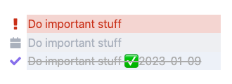

# 自定义状态样式

<span class="related-pages">#css #feature/statuses</span>

## 总结

如果您计划在Tasks中使用[[Custom Statuses|自定义状态]]，您需要安装并启用以下**其中一个**，以使您的任务看起来美观：

- 自定义CSS片段
- 主题

我们建议选择片段而不是主题。

这是因为如果您从主题中选择自定义复选框，您就永久绑定到该主题。

但是，大多数片段可以应用于任何主题，为您提供更多灵活性。

不同的CSS片段和主题在`[`和`]`内使用不同的字母和符号，所以更有效的做法是先选择您的样式，然后[[Set up custom statuses|设置您的自定义状态]]以支持您选择的样式所支持的符号字符。

本页面介绍下载和使用CSS片段来使它们看起来美观的过程。

## 假设

我们假设您知道如何[在Obsidian中使用CSS片段](https://help.obsidian.md/How+to/Add+custom+styles#Use+Themes+and+or+CSS+snippets)。

## 默认外观

假设我们有这三个带有自定义状态的任务：

```text
- [!] #task Do important stuff
- [D] #task Do important stuff
- [X] #task Do important stuff ✅ 2023-01-09
```

Tasks不知道任何自定义状态的含义。这意味着默认情况下，这些任务将显示如下：


- 我们原本希望前两个任务是"未完成"的，但它们有复选标记。
- 所有三个任务看起来都已完成，因为它们的`[]`中都没有空格。
- 只有带有`[X]`的任务有删除线。Tasks只将带有`[x]`或`[X]`的行视为已完成。

## 选择自定义样式：SlrVb的Alternate-Checkboxes

有许多社区片段和主题可用于自定义Obsidian中复选框的外观，不同的人有不同的偏好。

Tasks允许（并要求）您选择自己的样式选项。我们在[[About Status Collections|关于状态集合]]中有常见选项的列表。

在这个示例中，我们将选择使用[[Custom Statuses|SlRvb的Alternate Checkboxes]]来设置我们任务的样式。

## 安装SlrVb的Alternate-Checkboxes

[下载片段](https://github.com/SlRvb/Obsidian--ITS-Theme/blob/main/Guide/Alternate-Checkboxes.md)，将其添加到您库的片段文件夹中，并启用该片段。

上面的3个任务行现在看起来是这样的：


## 自定义自定义样式：Style Settings插件

我们还可以选择安装[Style Settings](https://github.com/mgmeyers/obsidian-style-settings)插件并自定义SlrVb的Alternate Checkboxes的外观。

- 使用此链接在您的库中[安装Style Settings插件](obsidian://show-plugin?id=obsidian-style-settings)
- 启用插件

现在我们可以进入Style Settings插件的选项：


展开"SlRvb's Checkboxes"部分并打开这些选项：


现在上面的三个任务看起来更加丰富多彩，带有`[x]`和`[X]`的任务被划掉，表示它们已完成：



## 相关页面

<!-- force a blank line --><!-- include: snippet-statuses-overview.md -->

> [!info]
> 理解和设置状态（或"替代复选框"）的大致步骤：
>
> - 了解状态是什么：
>   - [[Statuses|状态]]
>   - [[Custom Statuses|自定义状态]]
> - 选择您的状态样式方案：这将决定您自定义状态的名称和符号：
>   - 一些常见的显示在[[About Status Collections|关于状态集合]]中
> - 设置您的状态样式方案
>   - [[Style custom statuses|如何设置自定义状态样式]]。
> - 配置Tasks以使用您的自定义状态
>   - [[Set up custom statuses|如何设置您的自定义状态]]
>   - [[Check your Statuses|检查您的状态]]
> - 可选地，更新您的任务搜索以利用新的灵活性
>   - [[Filters#Filters for Task Statuses|任务状态过滤器]]

<!-- force a blank line --><!-- endInclude -->
