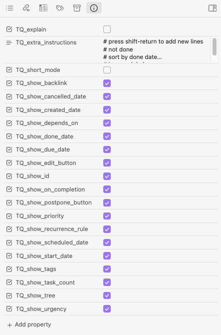

# 查询文件默认值

> [!released]
> 在Tasks 7.15.0中引入。

## 优势

这是一个相对专业的功能，使您能够：

1. **在不编辑`tasks`代码块源码的情况下修改Tasks查询中的[[layout|布局]]选项。**
    - 这可以节省您在阅读和编辑模式之间重复切换的时间。
    - 也许您通常喜欢使用某些[[Layout|布局]]选项查看Tasks搜索结果，但有时希望看到更多细节，也许根据您的心情打开和关闭`show tree`。
2. **自动将一个或多个指令插入到文件中的所有`tasks`代码块中。**
    - 您在一个Markdown文件中有多个Tasks查询，它们有很多共同的文本。
    - 您希望避免在每个查询中重复这些通用指令，因为保持它们一致是繁琐且容易出错的。
3. **提醒自己文件中所有`tasks`代码块的作用。**
    - 快速打开和关闭[[Explaining Queries|explain]]，当您需要提醒或想知道为什么某些任务没有包含在搜索中时。

## 概述

**查询文件默认值**类似于[[Global Query|全局查询]]，只是更具体：

- 全局查询：
  - 适用于**库中的所有查询**，
  - 在**Tasks设置**中定义。
- 查询文件默认值：
  - 适用于**文件中的所有查询**，
  - 在**文件开头的一个或多个标准[[#支持的查询文件默认值属性值|命名属性]]**中定义。

本页面结构：

- 本页面使用[[#示例]]来演示机制。
- 然后展示如何使用[[#Obsidian原生用户界面]]和[[#Meta Bind用户界面]]轻松调整文件的查询文件默认值。
- 最后，提供[[#技术细节]]并记录[[#查询文件默认值的限制|限制]]。

## 示例

提供这些示例是为了演示查询文件默认值的工作原理，以便所有支持的值（[[#支持的查询文件默认值属性值|下面列出]]）都应该有意义。

### 添加额外指令

可以使用`TQ_extra_instructions`属性在文件中所有查询的开头插入任意数量的Tasks指令：

```yaml
---
TQ_extra_instructions: |-
  not done
  group by filename
---
```

在Obsidian的文件属性编辑器中编辑`TQ_extra_instructions`时，您可以按`<Shift> + <Return>`插入新行。

> [!tip]
>
> - 当您在一个文件中有多个Tasks搜索块，并且希望所有搜索中都存在相同的指令时，`TQ_extra_instructions`特别有用。
> - 在此功能之前，如果这些标准指令发生更改，您必须记住更新每个搜索。
> - 现在您可以将这些标准指令放在`TQ_extra_instructions`中，只需在一个地方更新它们。
> - 自Tasks X.Y.Z起，`TQ_extra_instructions`确实支持[[Line Continuations|行继续]]。

> [!note]
> `TQ_extra_instructions`属性不是数组。它是一个单一的字符串值，`|-`允许它跨越多行。

### 简短或完整模式

假设包含我们查询的文件以以下内容开头：

<!-- snippet: DocsSamplesForDefaults.test.DocsSamplesForDefaults_demo-short-mode_yaml.approved.yaml -->
```yaml
---
TQ_short_mode: true
---
```
<!-- endSnippet -->

该文件中的任何Tasks代码块将在开头插入此内容：

<!-- snippet: DocsSamplesForDefaults.test.DocsSamplesForDefaults_demo-short-mode_instructions.approved.txt -->
```txt
short mode
```
<!-- endSnippet -->

`TQ_short_mode`的所有可能行为：

| `TQ_short_mode`值 | 生成的指令 |
| --------------------- | --------------------- |
| `true`                | `short mode`          |
| `false`               | `full mode`           |
| *无值*            | *无指令*      |

### 显示或隐藏树

假设包含我们查询的文件以以下内容开头：

```yaml
---
TQ_show_tree: true
---
```

该文件中的任何Tasks代码块将在开头插入此内容：

```txt
show tree
```

`TQ_show_tree`的所有可能行为：

| `TQ_show_tree`值 | 生成的指令 |
| -------------------- | --------------------- |
| `true`               | `show tree`           |
| `false`              | `hide tree`           |
| *无值*           | *无指令*      |

## 将指令应用于文件中的每个Tasks搜索

### Obsidian原生用户界面

您可以使用Obsidian的**文件属性**视图来自定义Tasks搜索：


<span class="caption">Obsidian的**文件属性**小部件，带有复选框和文本框来修改包含Tasks搜索的文件的查询文件默认值。请参阅[[#在Obsidian中加宽属性名称]]了解用于加宽属性名称的CSS片段。</span>

要尝试此功能：

1. 显示`文件属性`面板：
    - 启用Obsidian核心属性视图插件：`设置` > `核心插件` > 打开`属性视图`
    - 切换到阅读或实时预览模式。
    - 运行`属性视图：显示文件属性`命令。
2. 向文件添加一个或多个`TQ_*`属性
    - 点击`添加属性`。
    - 开始输入`TQ_`，或下面[[#支持的查询文件默认值属性值]]列表中属性名称的任何部分。
    - 按`<Return>`或`<Enter>`添加属性。
3. 现在您可以修改这些`TQ_*`属性来更改此文件中所有Tasks搜索的行为。

> [!tip]
> 使用命令**Tasks: 添加所有查询文件默认值属性**在一个简单步骤中将所有可用的`TQ_*`属性添加到活动笔记中。

#### 在Obsidian中加宽属性名称

默认情况下，Obsidian中的属性名称非常窄。

您可以使用以下CSS片段使它们更宽。

<!-- snippet: resources/sample_vaults/Tasks-Demo/.obsidian/snippets/widen-property-labels.css -->
```css
/* 使属性标签更宽，以适应Tasks特定属性的名称 */
.metadata-content {
    --metadata-label-width: 14em;
}
```
<!-- endSnippet -->

Obsidian用户指南显示了如何[在Obsidian中使用CSS片段](https://help.obsidian.md/How+to/Add+custom+styles#Use+Themes+and+or+CSS+snippets)。

### Meta Bind用户界面

请参阅[[Make a query user interface|制作查询用户界面]]了解如何将查询文件默认值与[[Meta Bind Plugin|Meta Bind插件]]一起使用，以创建用户界面来轻松自定义Tasks搜索的许多方面：


<span class="caption">Meta Bind小部件来编辑查询文件默认值</span>

## 技术细节

### 支持的查询文件默认值属性值

这些是Tasks当前支持的所有属性，作为查询文件默认值。

<!-- snippet: DocsSamplesForDefaults.test.DocsSamplesForDefaults_supported-properties-empty.approved.yaml -->
```yaml
---
TQ_explain:
TQ_extra_instructions:
TQ_short_mode:
TQ_show_backlink:
TQ_show_cancelled_date:
TQ_show_created_date:
TQ_show_depends_on:
TQ_show_done_date:
TQ_show_due_date:
TQ_show_edit_button:
TQ_show_id:
TQ_show_on_completion:
TQ_show_postpone_button:
TQ_show_priority:
TQ_show_recurrence_rule:
TQ_show_scheduled_date:
TQ_show_start_date:
TQ_show_tags:
TQ_show_task_count:
TQ_show_tree:
TQ_show_urgency:
---
```
<!-- endSnippet -->

### 命令：添加所有查询文件默认值属性

> [!tip]
> 使用命令**Tasks: 添加所有查询文件默认值属性**将所有这些属性添加到活动笔记中。

### 查询文件默认值属性值的类型

这些是Tasks当前支持的所有属性类型，作为查询文件默认值。

`type`值在Obsidian帮助的[属性类型](https://help.obsidian.md/Editing+and+formatting/Properties#Property+types)部分中有解释。

> [!tip]
> Tasks插件会自动将这些属性添加到Obsidian库中。

<!-- snippet: DocsSamplesForDefaults.test.DocsSamplesForDefaults_fake-types.json.approved.json -->
```json
{
  "types": {
    "TQ_explain": "checkbox",
    "TQ_extra_instructions": "text",
    "TQ_short_mode": "checkbox",
    "TQ_show_backlink": "checkbox",
    "TQ_show_cancelled_date": "checkbox",
    "TQ_show_created_date": "checkbox",
    "TQ_show_depends_on": "checkbox",
    "TQ_show_done_date": "checkbox",
    "TQ_show_due_date": "checkbox",
    "TQ_show_edit_button": "checkbox",
    "TQ_show_id": "checkbox",
    "TQ_show_on_completion": "checkbox",
    "TQ_show_postpone_button": "checkbox",
    "TQ_show_priority": "checkbox",
    "TQ_show_recurrence_rule": "checkbox",
    "TQ_show_scheduled_date": "checkbox",
    "TQ_show_start_date": "checkbox",
    "TQ_show_tags": "checkbox",
    "TQ_show_task_count": "checkbox",
    "TQ_show_tree": "checkbox",
    "TQ_show_urgency": "checkbox"
  }
}
```
<!-- endSnippet -->

## 查询文件默认值的限制

- **Canvas卡片**中的Tasks搜索无法使用[[Query File Defaults|查询文件默认值]]，因为[Canvas格式](https://jsoncanvas.org)不支持前言/属性。
  - 解决方法是使用Canvas的[转换为文件](https://help.obsidian.md/Plugins/Canvas#Add+text+cards)功能将包含Tasks查询的卡片转换为单独的Markdown笔记，嵌入到画布中。
  - 然后您可以将查询文件默认值添加到新笔记中。
